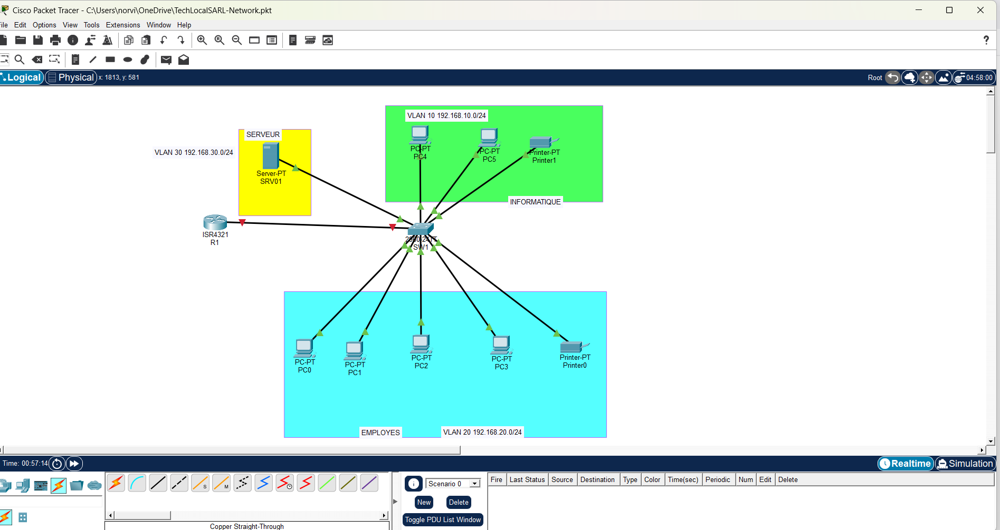

# TechLocalSARL – Projet de réseau d'entreprise

## 1. Présentation du projet

Ce projet a été réalisé sur Cisco Packet Tracer dans le cadre de mon apprentissage de l'administration réseau. Il consiste à concevoir et configurer le réseau informatique d'une petite entreprise fictive, TechLocalSARL.

À travers ce projet, je mets en pratique des notions fondamentales des réseaux d'entreprise : segmentation en VLAN, routage inter-VLAN, DHCP, DNS, ACL et sécurisation de l'administration réseau.

## 2. Contexte et problématique

TechLocalSARL est organisée autour d'un service informatique et d'un service d'employés. Un serveur central contient des ressources internes sensibles.

**Problématique :** comment permettre au service informatique d'accéder au serveur tout en empêchant les autres employés d'y accéder directement ?

## 3. Fonctionnalités mises en place

- VLAN 10 – INFORMATIQUE
- VLAN 20 – EMPLOYES
- VLAN 30 – SERVEURS
- trunk 802.1Q entre SW1 et R1
- routage inter-VLAN par sous-interfaces
- DHCP sur R1
- DNS sur SRV01
- ACL étendue `ACL-SERVEUR`
- sécurisation de R1 : `enable secret`, console protégée et timeout
- administration distante sécurisée par SSH version 2

## 4. Topologie

La topologie comprend 1 routeur, 1 switch, plusieurs ordinateurs, 1 serveur et des imprimantes.

## 5. Plan d'adressage

| VLAN | Réseau | Passerelle |
|---|---|---|
| VLAN 10 | 192.168.10.0/24 | 192.168.10.1 |
| VLAN 20 | 192.168.20.0/24 | 192.168.20.1 |
| VLAN 30 | 192.168.30.0/24 | 192.168.30.1 |

Serveur `SRV01` : **192.168.30.10**.

## 6. Sécurité du serveur

L'ACL `ACL-SERVEUR` autorise le VLAN 10 à accéder au serveur et autorise uniquement le DNS depuis le VLAN 20. Les autres communications du VLAN 20 vers le serveur sont bloquées.

Les tests confirment :

- **PC0 – VLAN 20** : résolution DNS réussie, accès direct au serveur bloqué ;
- **PC4 – VLAN 10** : résolution DNS et accès au serveur réussis.

## 7. Sécurisation de R1

R1 est protégé par :

- un `enable secret` ;
- une console authentifiée avec `exec-timeout 10 0` ;
- des lignes VTY utilisant l'authentification locale ;
- SSH version 2 ;
- `transport input ssh`, empêchant l'utilisation de Telnet ;
- un compte administrateur local de niveau de privilège 15.

Le test SSH depuis le LAN a été validé avec succès.

> Les mots de passe et secrets réels ne sont pas publiés dans ce dépôt.

## 8. Documentation

- 📘 [Configuration réseau détaillée](documentation/configuration-reseau.md)
- 🖼️ [Captures de configuration et de tests](screenshots/README.md)

## 9. État actuel

La segmentation, le routage inter-VLAN, le DHCP, le DNS, le filtrage ACL et la sécurisation administrative de R1 sont configurés et vérifiés dans Cisco Packet Tracer.

La configuration de R1 est sauvegardée dans la mémoire de démarrage avec `copy running-config startup-config`.