# Captures de configuration

Ce dossier regroupe les preuves visuelles du projet **TechLocalSARL-Network**, classées dans un ordre logique : configuration, vérifications, services réseau et sécurité.

## 1. Segmentation et VLAN

### Création des VLAN
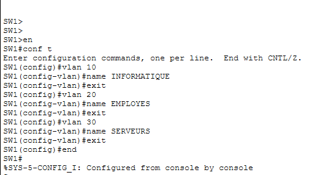

### Attribution des VLAN aux ports
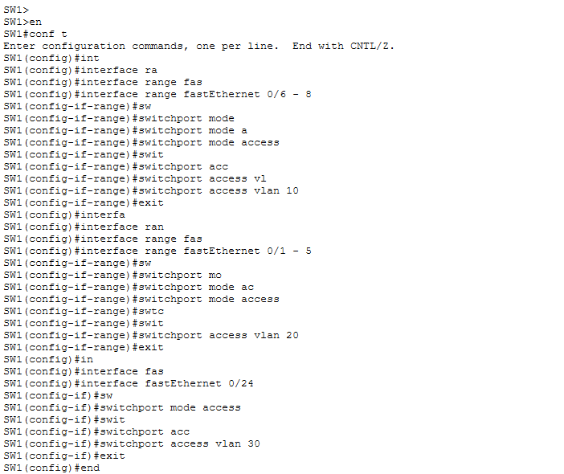

### Vérification des VLAN
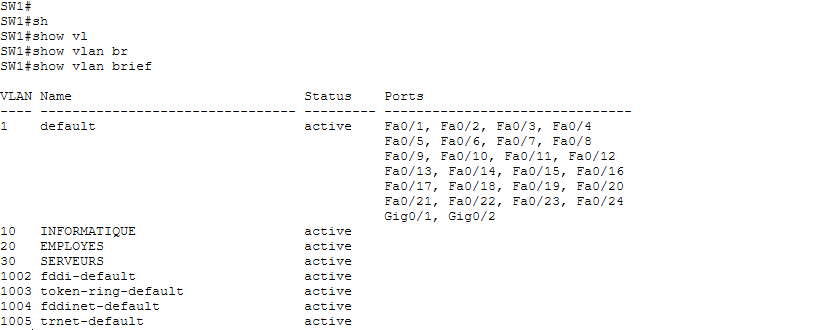

### Vérification des attributions
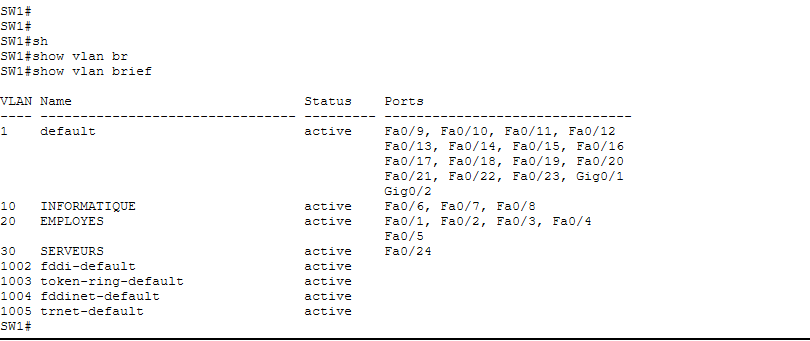

## 2. Trunk et routage inter-VLAN

### Configuration du trunk
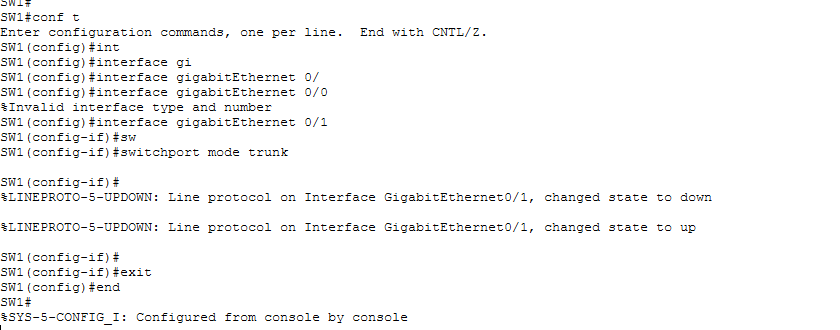

### Vérification du trunk
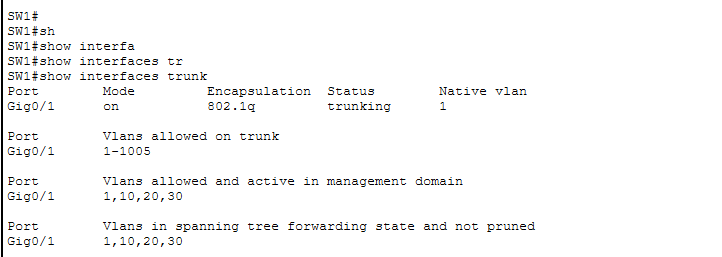

### Configuration du routage inter-VLAN
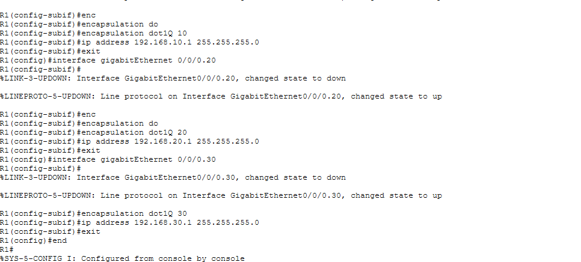

### Vérification du routage inter-VLAN
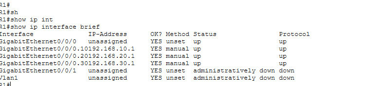

## 3. DHCP

### Ajout / préparation du DHCP
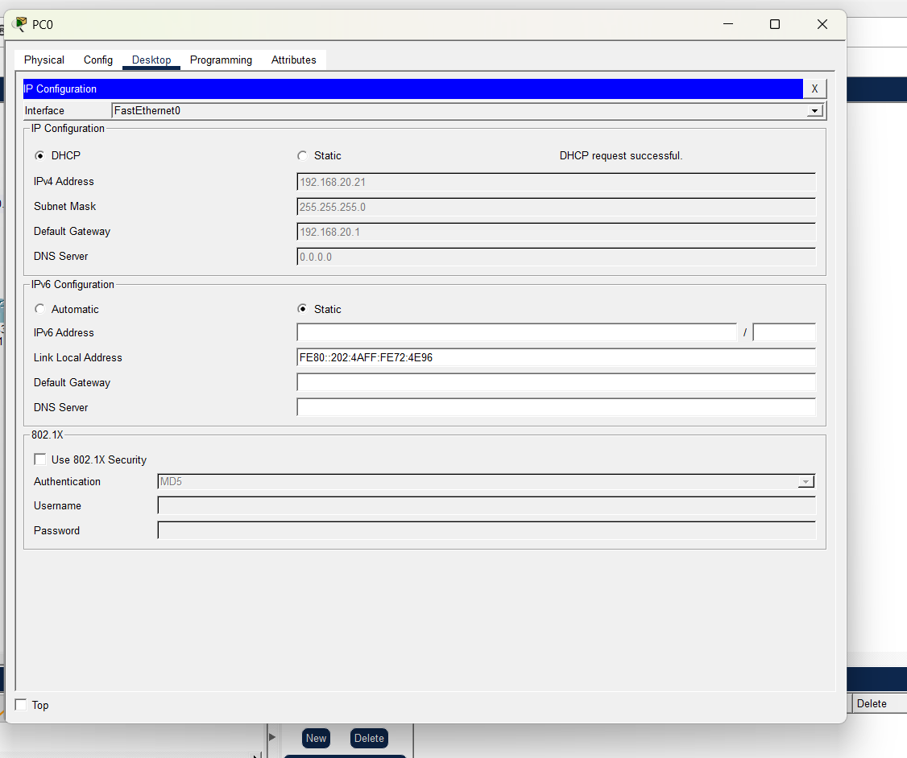

### Configuration DHCP
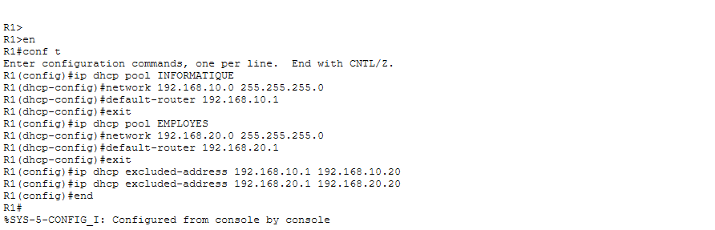

### Vérification DHCP
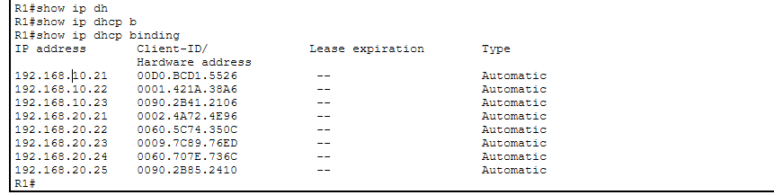

### Vérification des baux DHCP
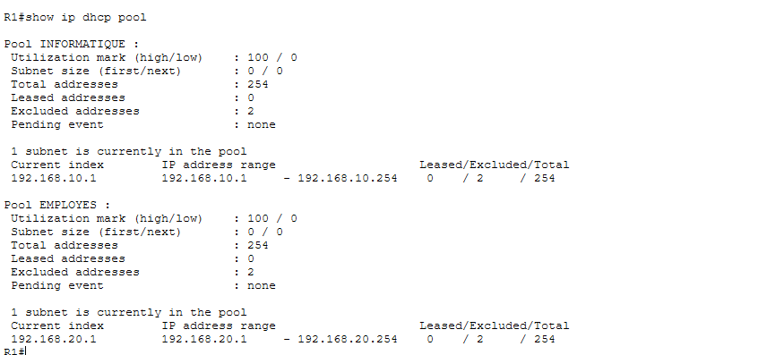

## 4. Sécurité — ACL-SERVEUR

### Configuration et application de l'ACL
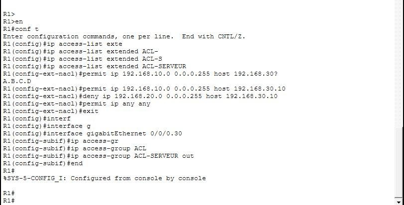

### PC0 — VLAN 20 : accès au serveur bloqué
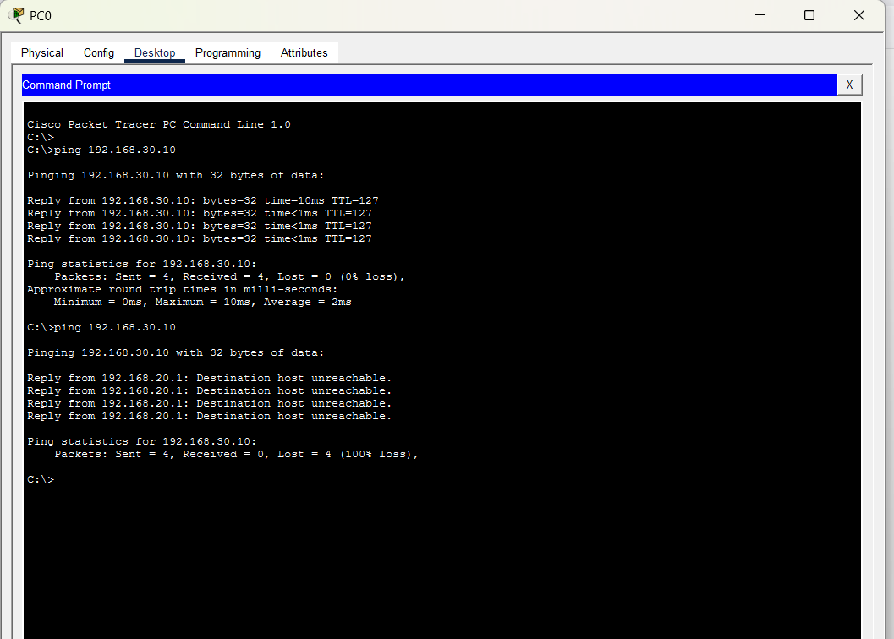

### PC4 — VLAN 10 : accès au serveur autorisé
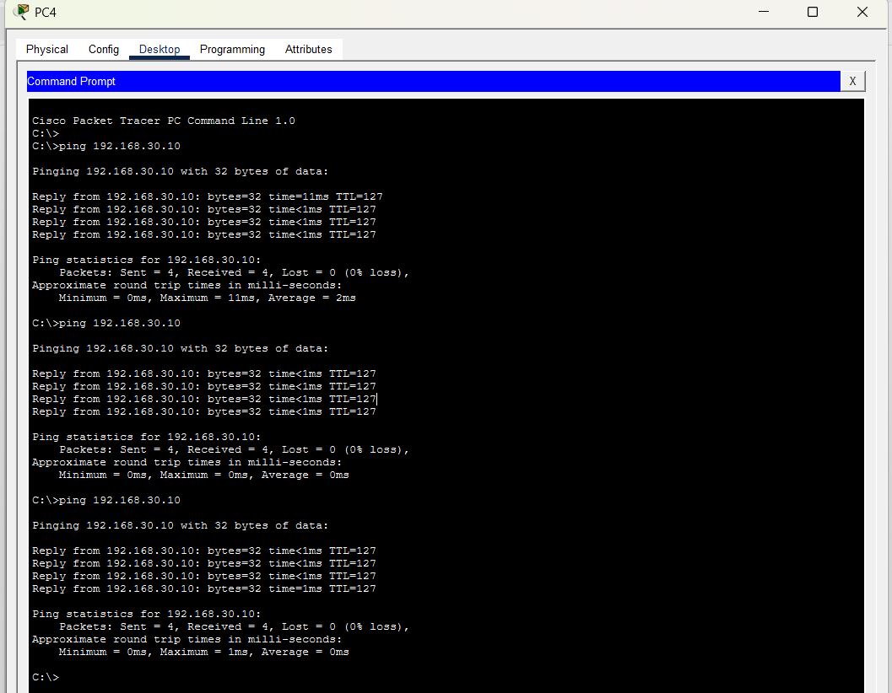

## Résultat attendu

- **VLAN 10 — INFORMATIQUE → SRV01 : autorisé**
- **VLAN 20 — EMPLOYES → SRV01 : bloqué**

Ces captures complètent la documentation technique du projet et permettent de vérifier visuellement les différentes étapes de configuration.